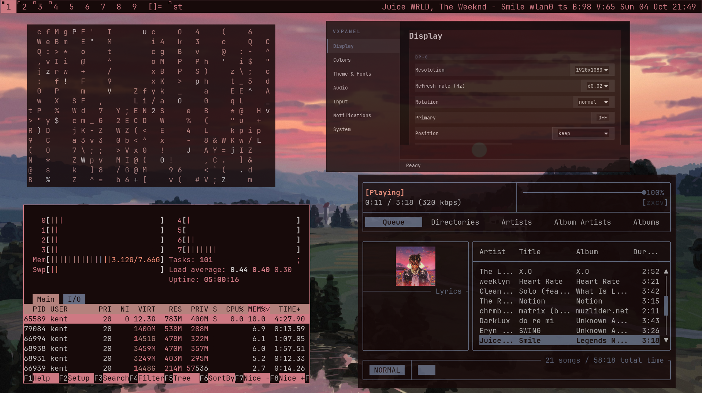

# Arch Linux Dotfiles

<p align="center">
  
</p>

XDG-first Arch Linux configuration for vxwm desktop environment, managed with GNU Stow.

## Features

- **Window Manager**: Custom vxwm (vendored and compiled from source)
- **Terminal**: st (Simple Terminal, vendored)
- **Shell**: Zsh with custom configuration
- **Status Bar**: vxwm built-in bar with zlstatus (Zig) for right side modules (MPD, network, battery, volume, date)
- **Application Launcher**: dmenu (vendored)
- **Compositor**: xcompmgr
- **File Manager**: yazi, thunar
- **Editor**: neovim
- **Multiplexer**: tmux
- **Music**: mpd + rmpc
- **Notifications**: dunst
- **Wallpapers**: pywal16 with xwallpaper

## Repository Structure

```
.
├── bash/              # ~/.bashrc, ~/.bash_profile, ~/.config/bash/
├── zsh/               # ~/.zshenv, ~/.config/zsh/ (ZDOTDIR)
├── shell/             # Shared XDG env + secrets example
├── x11/               # ~/.xinitrc, ~/.config/x11/
├── nvim/              # Neovim
├── tmux/              # Tmux (+ plugins tree)
├── dunst/ git/ mpd/ yazi/
├── feh/ flameshot/ gtk/ nvidia/ wal/   # small app configs
├── bin/               # ~/.local/bin scripts
├── share/             # Vendored sources: vxwm, st, dmenu, slock, nsxiv, zlstatus, cursors
├── wallpapers/        # ~/.local/share/wallpapers/
├── systemd/           # /etc files (not stowed; installed by install.sh)
├── bootstrap/         # packages-native.txt, packages-aur.txt
├── install.sh         # Full machine bootstrap
└── test-stow.sh       # Dry-run stow only
```

Each directory is a **Stow package**. There is no monolithic `config/` package — that caused path conflicts.


## Installation on Fresh Arch System

### 1. Clone the repository

```bash
git clone https://github.com/qbnil/dotfiles.git ~/dotfiles
cd ~/dotfiles
```

### 2. Run the installation script

The install script will:
- Update system packages
- Install all native packages from `packages-native.txt`
- Install yay AUR helper if not present
- Install AUR packages from `packages-aur.txt`
- Create XDG directories
- Backup existing configurations
- Deploy dotfiles using GNU Stow
- Build custom programs (vxwm, dmenu, st, slock, zlstatus)
- Set up systemd services

```bash
chmod +x install.sh
./install.sh
```

### 3. Configure personal information

After stowing the dotfiles, you need to configure your personal information:

#### Git Configuration

Edit your git config to set your email and name:

```bash
# Edit the git config file
$EDITOR ~/.config/git/config

# Replace placeholders with your information:
# email = YOUR_EMAIL@example.com  →  email = your.email@example.com
# name = YOUR_NAME                →  name = Your Name
```

#### Secrets and API Keys

The installation creates a template at `~/.config/shell/secrets.sh`. Edit it to add your API keys and tokens:

```bash
$EDITOR ~/.config/shell/secrets.sh

# Add your environment variables:
# export TAILSCALE_API_KEY="your-api-key-here"
# export TAILSCALE_TAILNET="your-email@example.com"
# export TAILSCALE_TARGET_DEVICE="your-device-hostname"
# export TAILSCALE_AUTH_KEY="tskey-auth-..."
# export TAILSCALE_EXIT_NODE="100.xxx.xxx.xxx"
```

#### Tailscale Scripts

If you use Tailscale, configure the environment variables in `~/.config/shell/secrets.sh`:

- `TAILSCALE_API_KEY` - Your Tailscale API key
- `TAILSCALE_TAILNET` - Your tailnet email (e.g., your-email@example.com)
- `TAILSCALE_TARGET_DEVICE` - Device hostname to target for removal
- `TAILSCALE_AUTH_KEY` - Your Tailscale auth key for `tailscale up`
- `TAILSCALE_EXIT_NODE` - Exit node IP (optional)

Then the scripts `tailscale-fix` and `tailscale-remove-node` will work.

### 4. Log out and back in

Apply all shell and environment changes by logging out and back in.

### 5. Start X session

```bash
startx
```

## Manual Installation (Advanced)

If you prefer manual control:

```bash
# Install packages
sudo pacman -Syu
sudo pacman -S --needed - < bootstrap/packages-native.txt
yay -S --needed - < bootstrap/packages-aur.txt

# Create XDG directories
mkdir -p ~/.config ~/.local/{bin,share,state} ~/.cache

# Deploy dotfiles with stow
cd ~/dotfiles
stow bash shell zsh x11 nvim tmux git dunst mpd yazi btop scripts

# Build custom programs
cd ~/.local/share/vxwm && make && install -Dm755 vxwm ~/.local/bin/vxwm
cd ~/.local/share/dmenu && make && install -Dm755 dmenu stest ~/.local/bin/
cd ~/.local/share/st-terminal && make && install -Dm755 st ~/.local/bin/st
cd ~/.local/share/slock && make && sudo install -Dm4755 slock /usr/local/bin/slock
cd ~/.local/share/zlstatus && zig build && install -Dm755 zig-out/bin/zlstatus ~/.local/bin/zlstatus

# Set up ZDOTDIR
echo 'export ZDOTDIR="$HOME/.config/zsh"' > ~/.zshenv

# Create secrets file
cp ~/dotfiles/shell/.config/shell/secrets.sh.example ~/.config/shell/secrets.sh
chmod 600 ~/.config/shell/secrets.sh
$EDITOR ~/.config/shell/secrets.sh
```

## Stow Management

### Deploy a package

```bash
cd ~/dotfiles
stow packagename
```

### Remove a package

```bash
cd ~/dotfiles
stow -D packagename
```

### Restow (update) a package

```bash
cd ~/dotfiles
stow -R packagename
```

### Preview changes (dry run)

```bash
cd ~/dotfiles
stow --simulate --verbose packagename
```

## Key Components

### Shell Environment

- **XDG Base Directory**: Properly configured for all applications
- **Shell**: Zsh with custom prompt, history, and keybindings
- **Environment**: Centralized in `~/.config/shell/xdg-env.sh`
- **Secrets**: Separate `secrets.sh` file (gitignored) for API keys

### Window Manager (vxwm)

Custom tiling window manager built from source. Configuration in `~/.local/share/vxwm/config.h`.

Key features:
- Dynamic tiling layouts
- Custom keybindings
- Minimal resource usage
- Integrated with zlstatus

### Programs

All suckless-style programs are vendored in `share/.local/share/` with their source code and configurations. Build artifacts are ignored by git and regenerated on each machine.

## Secrets Management

Secrets are stored in `~/.config/shell/secrets.sh` and sourced by `xdg-env.sh`. This file is:
- **Never committed** to git (in .gitignore)
- **Created from template** `secrets.sh.example` during installation
- **Sourced automatically** by the shell environment

Add your API keys there:
```bash
export ANTHROPIC_AUTH_TOKEN="your-token-here"
export TAILSCALE_AUTHKEY="your-key-here"
# etc.
```

## Package Lists

### Updating Package Lists

After installing new packages:

```bash
# Native packages
pacman -Qn | awk '{print $1}' > bootstrap/packages-native.txt

# AUR packages
pacman -Qm | awk '{print $1}' > bootstrap/packages-aur.txt

# Commit the changes
git add bootstrap/packages-*.txt
git commit -m "Update package lists"
```

## Maintenance

### Update dotfiles from git

```bash
cd ~/dotfiles
git pull
stow -R bash shell zsh x11 nvim tmux git dunst mpd yazi btop scripts
```

### Rebuild custom programs

```bash
cd ~/.local/share/vxwm && make clean && make && install -Dm755 vxwm ~/.local/bin/vxwm
cd ~/.local/share/dmenu && make clean && make && install -Dm755 dmenu stest ~/.local/bin/
# etc.
```

### Backup current configurations

```bash
backup_dir="$HOME/dotfiles-backup-$(date +%Y%m%d-%H%M%S)"
mkdir -p "$backup_dir"
cp -a ~/.config "$backup_dir/"
cp -a ~/.local/bin "$backup_dir/"
```

## What's Gitignored

- **Secrets**: API keys, tokens, credentials, SSH keys
- **Build artifacts**: `.o`, `.so`, compiled binaries
- **Runtime files**: History files, cache, Xauthority
- **Cache directories**: Any `.cache/` folders
- **Editor files**: Swap files, IDE directories

See `.gitignore` for full list.

## Nvidia Laptop Suspend/Resume Fix

If you have a laptop with an Nvidia GPU (like GTX 1650) and experience a black screen with only a cursor after closing and reopening the lid, this repository includes a comprehensive fix.

### The Problem

When closing the laptop lid:
- Screen turns off properly
- Laptop goes into suspend
- After opening the lid: **black screen with cursor only**
- Can't do anything except login to different tty or reboot

### The Solution

The fix includes three components:

1. **Kernel Parameter** - Forces Nvidia driver to use kernel mode setting
2. **Systemd Sleep Hook** - Reinitializes GPU on resume
3. **Modprobe Configuration** - Optimizes driver for suspend/resume

### Installation

Run the automated setup script:

```bash
~/.local/bin/fix-nvidia-suspend
```

The script will:
- Add `nvidia_drm.modeset=1` to GRUB kernel parameters
- Install systemd sleep hook at `/etc/systemd/system-sleep/nvidia-suspend.sh`
- Create Nvidia modprobe configuration at `/etc/modprobe.d/nvidia.conf`
- Backup existing configurations before making changes

**Important:** Reboot after running the script for changes to take effect.

### Manual Installation

If you prefer to install manually:

```bash
# 1. Copy systemd sleep hook
sudo cp ~/dotfiles/systemd/etc/systemd/system-sleep/nvidia-suspend.sh /etc/systemd/system-sleep/
sudo chmod +x /etc/systemd/system-sleep/nvidia-suspend.sh

# 2. Copy modprobe configuration
sudo cp ~/dotfiles/systemd/etc/modprobe.d/nvidia.conf /etc/modprobe.d/

# 3. Update GRUB
sudo nano /etc/default/grub
# Add nvidia_drm.modeset=1 to GRUB_CMDLINE_LINUX_DEFAULT
sudo grub-mkconfig -o /boot/grub/grub.cfg

# 4. Reboot
sudo reboot
```

### Testing

After rebooting:
1. Close the laptop lid (or run: `systemctl suspend`)
2. Open the lid or press a key to wake
3. Screen should properly resume now

If issues persist, try pressing `Alt+F2` after waking to manually switch ttys.

### What It Does

- **nvidia_drm.modeset=1**: Enables kernel mode setting for the Nvidia driver, which is more reliable for suspend/resume
- **Sleep hook**: Automatically reloads Nvidia kernel modules (nvidia, nvidia_modeset, nvidia_drm) when resuming from suspend
- **Modprobe config**: Sets `NVreg_UsePageAttributeTable=1` and confirms `nvidia_drm.modeset=1` at module load time

For more details, see the documentation in `~/.local/share/documents/helpbook/linux <3 nvidia-suspend-resume-fix.md`

## Troubleshooting

### Stow conflicts

If stow reports conflicts with existing files:

```bash
# Option 1: Backup and remove existing files
mv ~/.config/zsh ~/.config/zsh.bak

# Option 2: Adopt existing files into repo
cd ~/dotfiles
stow --adopt zsh
git diff  # Review what was adopted
```

### Build errors

Ensure you have the required build dependencies:
- base-devel package group
- libx11, libxft, libxinerama for suckless tools
- zig for zlstatus

### Missing secrets

If environment variables are undefined, ensure `~/.config/shell/secrets.sh` exists and is sourced.

## License

Personal dotfiles - use at your own discretion.
